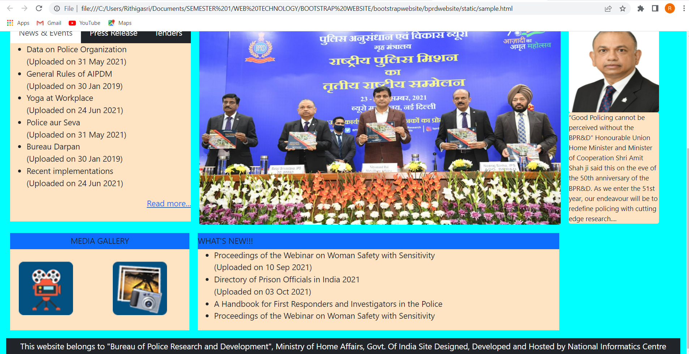
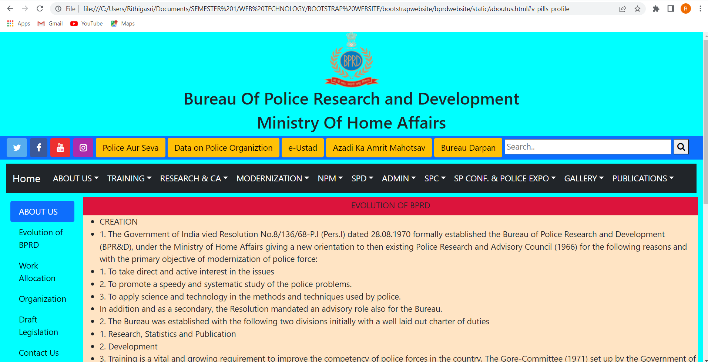
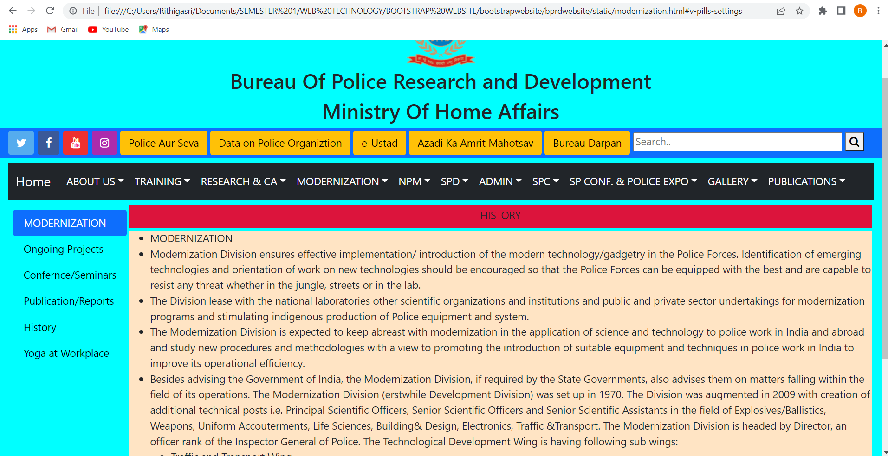

# Web Design using Bootstrap Framework

## AIM:
To design a website using bootstrap framework.

## DESIGN STEPS:

### Step 1:

Requirement collection.

### Step 2:

Creating the layout using bootstrap grid system.

### Step 3:

Updating the sample content.

### Step 4:

Choose the appropriate style and color scheme.

### Step 5:

Validate the layout in various browsers.

### Step 6:

Validate the HTML code.

### Step 6:

Publish the website in the given URL.

## PROGRAM :
### HOME PAGE CODE:
```
<!DOCTYPE html>
<html lang="en">
<head>
    <meta charset="UTF-8">
    <meta http-equiv="X-UA-Compatible" content="IE=edge">
    <meta name="viewport" content="width=device-width, initial-scale=1.0">
    <title>Bootstrap Website</title>
    <link href="https://cdn.jsdelivr.net/npm/bootstrap@5.0.2/dist/css/bootstrap.min.css" rel="stylesheet" integrity="sha384-EVSTQN3/azprG1Anm3QDgpJLIm9Nao0Yz1ztcQTwFspd3yD65VohhpuuCOmLASjC" crossorigin="anonymous">
    <script src="https://cdn.jsdelivr.net/npm/bootstrap@5.0.2/dist/js/bootstrap.bundle.min.js" integrity="sha384-MrcW6ZMFYlzcLA8Nl+NtUVF0sA7MsXsP1UyJoMp4YLEuNSfAP+JcXn/tWtIaxVXM" crossorigin="anonymous"></script>
    <link rel="stylesheet" href="https://cdnjs.cloudflare.com/ajax/libs/font-awesome/4.7.0/css/font-awesome.min.css">
    
</head>
<body class="container-fluid" style="background-color:cyan">
    <div>
        
        <h2 class="text-center">Bureau Of Police Research and Development</h2>
        <h2 class="text-center">Ministry Of Home Affairs</h2>
    </div>
    
    <div class="row form-group">
        <div class="bg-primary pt-1 pb-1">
               
                
                <a class="btn btn-primary" style="background-color:#55acee;" href="#!" role="button">
                    <i class="fa fa-twitter"></i>
                </a>
                <a class="btn btn-primary" style="background-color: #3b5998;" href="#!" role="button">
                    <i class="fa fa-facebook-f"></i>
                </a>
                <a class="btn btn-primary" style="background-color:#ed302f;" href="#!" role="button">
                    <i class="fa fa-youtube"></i>
                </a>
                <a class="btn btn-primary" style="background-color: #ac2bac;" href="#!" role="button">
                    <i class="fa fa-instagram"></i>
                </a>
            
                <button type="button" class="btn btn-warning text-center ">Police Aur Seva</button>
                <button type="button" class="btn btn-warning text-center ">Data  on Police Organiztion</button>
                <button type="button" class="btn btn-warning text-center">e-Ustad</button>
                <button type="button" class="btn btn-warning text-center">Azadi Ka Amrit Mahotsav</button>
                <button type="button" class="btn btn-warning text-center">Bureau Darpan</button>
               
                <input  type="text" placeholder="Search.." name="search" style="width:360px" >
                <button  type="submit"><i class="fa fa-search"></i></button>
        </div>
    </div>
    <nav class="navbar navbar-expand-sm bg-dark navbar-dark mt-2" >
        <div class="container-fluid">
          <a class="navbar-brand" href="#">Home</a>
          <button class="navbar-toggler" type="button" data-bs-toggle="collapse" data-bs-target="#collapsibleNavbar">
            <span class="navbar-toggler-icon"></span>
          </button>
          <div class="collapse navbar-collapse" id="collapsibleNavbar">
            <ul class="navbar-nav">
              <li class="nav-item dropdown">
                <a class="nav-link dropdown-toggle" href="#" role="button" data-bs-toggle="dropdown" style="color:white;">ABOUT US</a>
                <ul class="dropdown-menu">
                  <li><a class="dropdown-item" href="#">Evolution Of BPRD</a></li>
                  <li><a class="dropdown-item" href="#">Awards/Medals</a></li>
                  <li><a class="dropdown-item" href="#">Work Allocation</a></li>
                  <li><a class="dropdown-item" href="#">Organization</a></li>
                  <li><a class="dropdown-item" href="#">Draft Legistation</a></li>
                  <li><a class="dropdown-item" href="#">Contact Us</a></li>
                  <li><a class="dropdown-item" href="#">Citizens Corner</a></li>
                </ul>
              </li>
            </ul>
            <ul class="navbar-nav">
              <li class="nav-item dropdown">
                <a class="nav-link dropdown-toggle" href="#" role="button" data-bs-toggle="dropdown" style="color:white;">TRAINING</a>
                <ul class="dropdown-menu">
                  <li><a class="dropdown-item" href="#">Domestic Courses</a></li>
                  <li><a class="dropdown-item" href="#">Foreign Courses</a></li>
                  <li><a class="dropdown-item" href="#">Training Calender</a></li>
                  <li><a class="dropdown-item" href="#">Miscellaneous</a></li>
                  <li><a class="dropdown-item" href="#">Training Policy</a></li>
                  <li><a class="dropdown-item" href="#">Training Material</a></li>
                  <li><a class="dropdown-item" href="#">Training Division</a></li>
                  <li><a class="dropdown-item" href="#">Training Symposium</a></li>
                  <li><a class="dropdown-item" href="#">CAPT,Bhopal</a></li>
                  <li><a class="dropdown-item" href="#">CDTI</a></li>
                  <li><a class="dropdown-item" href="#">Union Home Minister Trophy</a></li>
                  <li><a class="dropdown-item" href="#">Union Home Minister Training Medal</a></li>
                  <li><a class="dropdown-item" href="#">Publications</a></li>
                  <li><a class="dropdown-item" href="#">Women Safety</a></li>
                  <li><a class="dropdown-item" href="#">Online Courses</a></li>
                </ul>
              </li>
            </ul>
            <ul class="navbar-nav">
              <li class="nav-item dropdown">
                <a class="nav-link dropdown-toggle" href="#" role="button" data-bs-toggle="dropdown" style="color:white;">RESEARCH & CA</a>
                <ul class="dropdown-menu">
                  <li><a class="dropdown-item" href="#">Research</a></li>
                  <li><a class="dropdown-item" href="#">Correctional Admin</a></li>
                  <li><a class="dropdown-item" href="#">All India Prison Duty Meet</a></li>
                  <li><a class="dropdown-item" href="#">Women Safety And Security A Handbook</a></li>
                  <li><a class="dropdown-item" href="#">Model Prison Manual 2016</a></li>
                  <li><a class="dropdown-item" href="#">National Police Research Repository</a></li>
                  <li><a class="dropdown-item" href="#">Interns Talk</a></li>
                  <li><a class="dropdown-item" href="#">SC Questionnaire</a></li>
                </ul>
              </li>
            </ul>
            <ul class="navbar-nav">
              <li class="nav-item dropdown">
                <a class="nav-link dropdown-toggle" href="#" role="button" data-bs-toggle="dropdown" style="color:white;">MODERNIZATION</a>
                <ul class="dropdown-menu">
                  <li><a class="dropdown-item" href="#">History</a></li>
                  <li><a class="dropdown-item" href="#">Mandate Of Modernization Division</a></li>
                  <li><a class="dropdown-item" href="#">Demonstration/Presentation/Trial</a></li>
                  <li><a class="dropdown-item" href="#">Ongoing Projects</a></li>
                  <li><a class="dropdown-item" href="#">Conference/Seminar/Workshop</a></li>
                  <li><a class="dropdown-item" href="#">Publications/Reports</a></li>
                  <li><a class="dropdown-item" href="#">Yoga At Workplace</a></li>
                </ul>
              </li>
            </ul>
            <ul class="navbar-nav">
              <li class="nav-item dropdown">
                <a class="nav-link dropdown-toggle" href="#" role="button" data-bs-toggle="dropdown" style="color:white;">NPM</a>
                <ul class="dropdown-menu">
                  <li><a class="dropdown-item" href="#">Genesis</a></li>
                  <li><a class="dropdown-item" href="#">Concept And Objectives</a></li>
                  <li><a class="dropdown-item" href="#">Structure</a></li>
                  <li><a class="dropdown-item" href="#">Status Of Projects</a></li>
                  <li><a class="dropdown-item" href="#">Publications of NPM</a></li>
                  <li><a class="dropdown-item" href="#">Model Police Act</a></li>
                  <li><a class="dropdown-item" href="#">National Conference Of Women In Police</a></li>
                </ul>
              </li>
            </ul>
            <ul class="navbar-nav">
              <li class="nav-item dropdown">
                <a class="nav-link dropdown-toggle" href="#" role="button" data-bs-toggle="dropdown" style="color:white;">SPD</a>
                <ul class="dropdown-menu">
                  <li><a class="dropdown-item" href="#">Data On Police Organization</a></li>
                  <li><a class="dropdown-item" href="#">Police Book Of BPRandD</a></li>
                  <li><a class="dropdown-item" href="#">Indian Police Journal</a></li>
                  <li><a class="dropdown-item" href="#">Model Police Manual</a></li>
                  <li><a class="dropdown-item" href="#">Police Vigyan</a></li>
                  <li><a class="dropdown-item" href="#">Library</a></li>
                  <li><a class="dropdown-item" href="#">Raj Bhasha</a></li>
                </ul>
              </li>
            </ul>
            <ul class="navbar-nav">
              <li class="nav-item dropdown">
                <a class="nav-link dropdown-toggle" href="#" role="button" data-bs-toggle="dropdown" style="color:white;">ADMIN</a>
                <ul class="dropdown-menu">
                  <li><a class="dropdown-item" href="#">Administration Division</a></li>
                  <li><a class="dropdown-item" href="#">Recruitment Rules</a></li>
                  <li><a class="dropdown-item" href="#">Ongoing Projects</a></li>
                  <li><a class="dropdown-item" href="#">Recruitments</a></li>
                  <li><a class="dropdown-item" href="#">Women Welfare</a></li>
                  <li><a class="dropdown-item" href="#">IPR</a></li>
                  <li><a class="dropdown-item" href="#">Vacancies</a></li>
                </ul>
              </li>
            </ul>
            <ul class="navbar-nav">
              <li class="nav-item dropdown">
                <a class="nav-link dropdown-toggle" href="#" role="button" data-bs-toggle="dropdown" style="color:white;">SPC</a>
                <ul class="dropdown-menu">
                  <li><a class="dropdown-item" href="#">Students Police Cadet Programme</a></li>
                  <li><a class="dropdown-item" href="#">SPC Web</a></li>
                </ul>
              </li>
            </ul>
            <ul class="navbar-nav">
              <li class="nav-item dropdown">
                <a class="nav-link dropdown-toggle" href="#" role="button" data-bs-toggle="dropdown" style="color:white;">SP CONF. & POLICE EXPO</a>
                <ul class="dropdown-menu">
                  <li><a class="dropdown-item" href="#">Police Expo And 3rd Young SP Conference</a></li>
                  <li><a class="dropdown-item" href="#">Photo Gallery Police Expo 2020</a></li>
                </ul>
              </li>
            </ul>
            <ul class="navbar-nav">
              <li class="nav-item dropdown">
                <a class="nav-link dropdown-toggle" href="#" role="button" data-bs-toggle="dropdown" style="color:white;">GALLERY</a>
                <ul class="dropdown-menu">
                  <li><a class="dropdown-item" href="#">Photo Gallery</a></li>
                </ul>
              </li>
            </ul>
            <ul class="navbar-nav">
              <li class="nav-item dropdown">
                <a class="nav-link dropdown-toggle" href="#" role="button" data-bs-toggle="dropdown" style="color:white;">PUBLICATIONS</a>
                <ul class="dropdown-menu">
                    <li><a class="dropdown-item" href="#">PDF</a></li>
                </ul>
              </li>
            </ul>
          </div>  
        </nav>
        <div class="d-flex flex-nowrap bd-highlight">
          <div class="order-1 p-2 bd-highlight">
            <nav>     
              <div class="nav nav-tabs mt-3 " id="nav-tab" role="tablist" style="width:400px">
                <button class="nav-link active " id="nav-home-tab" data-bs-toggle="tab" data-bs-target="#nav-home" type="button" role="tab" aria-controls="nav-home" aria-selected="true">News & Events</button>
                <button class="nav-link  bg-dark" id="nav-profile-tab" data-bs-toggle="tab" data-bs-target="#nav-profile" type="button" role="tab" aria-controls="nav-profile" aria-selected="false" style="color: white;">Press Release</button>
                <button class="nav-link bg-dark " id="nav-contact-tab" data-bs-toggle="tab" data-bs-target="#nav-contact" type="button" role="tab" aria-controls="nav-contact" aria-selected="false" style="color: white;">Tenders</button>            </div>
            </nav>
              
            
              <div class="tab-content pb-4 " id="nav-tabContent" style="width: 400px;background-color: bisque">
                <div class="tab-pane fade show active" id="nav-home" role="tabpanel" aria-labelledby="nav-home-tab">
                  <ul>
                    <li>Data on Police Organization <br/>(Uploaded on 31 May 2021)</li>
                    <li>General Rules of AIPDM<br/>(Uploaded on 30 Jan 2019)</li>
                    <li>Yoga at Workplace<br/>(Uploaded on 24 Jun 2021)</li>
                    <li>Police aur Seva <br/>(Uploaded on 31 May 2021)</li>
                    <li>Bureau Darpan<br/>(Uploaded on 30 Jan 2019)</li>
                    <li>Recent implementations<br/>(Uploaded on 24 Jun 2021)</li>  
                  </ul>
                  <div class="d-flex flex-row-reverse bd-highlight"><a href="#">Read more...</a></div>
                </div>
              </div> 
          </div>
            <div class="order-2 p-2 bd-highlight">
              
            </div>
            <div class="panel panel-default order-3 p-2  bd-highlight">
              
              <div class="panel-body rounded mx-auto text-justify " style="background-color: bisque;width: 200px;font-size:15px;">“Good Policing cannot be perceived without the BPR&D” 
                

                Honourable Union Home Minister and Minister of Cooperation Shri Amit Shah ji said this on the eve of the 50th anniversary of the BPR&D.
                As we enter the 51st year, our endeavour will be to redefine policing with cutting edge research....</div>
            </div>
        </div>
        <div class="d-flex flex-nowrap bd-highlight">
          <div class="panel panel-default order-1 p-2  bd-highlight" style="width: 415px;">
            <div class="panel-heading bg-primary text-center pt-1 pb-1">MEDIA GALLERY</div>
              <div class="panel-body d-flex flex-nowrap bd-highlight pt-3 pb-2 " style="background-color: bisque;height: 180px;padding-left: 10px;">
                <div class="order-1 p-2 bd-highlight" >
                  
                </div>
                <div class="order-1 p-2  bd-highlight" style="margin-left: 70px;">
                  
                </div>
              </div>
              
          </div>
          <div class="panel panel-default order-2 p-2  bd-highlight">
            <div class="panel-heading bg-primary pt-1 pb-1" style="width: 800px;">WHAT'S NEW!!!</div>
            <div class="panel-body" style="background-color:bisque;height: 180px;">
              <ul>
                <li>Proceedings of the Webinar on Woman Safety with Sensitivity<br/>(Uploaded on 10 Sep 2021) </li>
                <li>Directory of Prison Officials in India 2021 <br/>(Uploaded on 03 Oct 2021)</li>
                <li>A Handbook for First Responders and Investigators in the Police  </li>
                <li>Proceedings of the Webinar on Woman Safety with Sensitivity</li>
              </ul>
            
            </div>
          </div>
        </div>
        <div class="mt-2 pt-1 bg-dark text-white text-center" style="height:40px">
          <p>This website belongs to "Bureau of Police Research and Development", Ministry of Home Affairs, Govt. Of India Site Designed, Developed and Hosted by National Informatics Centre</p>
        </div>

        
      
        
        
</body>
</html>
```
### ABOUT US PAGE CODE
```<!DOCTYPE html>
<html lang="en">
<head>
    <meta charset="UTF-8">
    <meta http-equiv="X-UA-Compatible" content="IE=edge">
    <meta name="viewport" content="width=device-width, initial-scale=1.0">
    <title>Bootstrap Website</title>
    <link href="https://cdn.jsdelivr.net/npm/bootstrap@5.0.2/dist/css/bootstrap.min.css" rel="stylesheet" integrity="sha384-EVSTQN3/azprG1Anm3QDgpJLIm9Nao0Yz1ztcQTwFspd3yD65VohhpuuCOmLASjC" crossorigin="anonymous">
    <script src="https://cdn.jsdelivr.net/npm/bootstrap@5.0.2/dist/js/bootstrap.bundle.min.js" integrity="sha384-MrcW6ZMFYlzcLA8Nl+NtUVF0sA7MsXsP1UyJoMp4YLEuNSfAP+JcXn/tWtIaxVXM" crossorigin="anonymous"></script>
    <link rel="stylesheet" href="https://cdnjs.cloudflare.com/ajax/libs/font-awesome/4.7.0/css/font-awesome.min.css">
    
    
</head>
<body class="container-fluid" style="background-color:cyan">
    <div>
        
        <h2 class="text-center">Bureau Of Police Research and Development</h2>
        <h2 class="text-center">Ministry Of Home Affairs</h2>
    </div>
    
    <div class="row form-group">
        <div class="bg-primary pt-1 pb-1">
               
                
                <a class="btn btn-primary" style="background-color:#55acee;" href="#!" role="button">
                    <i class="fa fa-twitter"></i>
                </a>
                <a class="btn btn-primary" style="background-color: #3b5998;" href="#!" role="button">
                    <i class="fa fa-facebook-f"></i>
                </a>
                <a class="btn btn-primary" style="background-color:#ed302f;" href="#!" role="button">
                    <i class="fa fa-youtube"></i>
                </a>
                <a class="btn btn-primary" style="background-color: #ac2bac;" href="#!" role="button">
                    <i class="fa fa-instagram"></i>
                </a>
            
                <button type="button" class="btn btn-warning text-center ">Police Aur Seva</button>
                <button type="button" class="btn btn-warning text-center ">Data  on Police Organiztion</button>
                <button type="button" class="btn btn-warning text-center">e-Ustad</button>
                <button type="button" class="btn btn-warning text-center">Azadi Ka Amrit Mahotsav</button>
                <button type="button" class="btn btn-warning text-center">Bureau Darpan</button>
               
                <input  type="text" placeholder="Search.." name="search" style="width:360px" >
                <button  type="submit"><i class="fa fa-search"></i></button>
        </div>
    </div>
    <nav class="navbar navbar-expand-sm bg-dark navbar-dark mt-2" >
        <div class="container-fluid">
          <a class="navbar-brand" href="#">Home</a>
          <button class="navbar-toggler" type="button" data-bs-toggle="collapse" data-bs-target="#collapsibleNavbar">
            <span class="navbar-toggler-icon"></span>
          </button>
          <div class="collapse navbar-collapse" id="collapsibleNavbar">
            <ul class="navbar-nav">
              <li class="nav-item dropdown">
                <a class="nav-link dropdown-toggle" href="#" role="button" data-bs-toggle="dropdown" style="color:white;">ABOUT US</a>
                <ul class="dropdown-menu">
                  <li><a class="dropdown-item" href="#">Evolution Of BPRD</a></li>
                  <li><a class="dropdown-item" href="#">Awards/Medals</a></li>
                  <li><a class="dropdown-item" href="#">Work Allocation</a></li>
                  <li><a class="dropdown-item" href="#">Organization</a></li>
                  <li><a class="dropdown-item" href="#">Draft Legistation</a></li>
                  <li><a class="dropdown-item" href="#">Contact Us</a></li>
                  <li><a class="dropdown-item" href="#">Citizens Corner</a></li>
                </ul>
              </li>
            </ul>
            <ul class="navbar-nav">
              <li class="nav-item dropdown">
                <a class="nav-link dropdown-toggle" href="#" role="button" data-bs-toggle="dropdown" style="color:white;">TRAINING</a>
                <ul class="dropdown-menu">
                  <li><a class="dropdown-item" href="#">Domestic Courses</a></li>
                  <li><a class="dropdown-item" href="#">Foreign Courses</a></li>
                  <li><a class="dropdown-item" href="#">Training Calender</a></li>
                  <li><a class="dropdown-item" href="#">Miscellaneous</a></li>
                  <li><a class="dropdown-item" href="#">Training Policy</a></li>
                  <li><a class="dropdown-item" href="#">Training Material</a></li>
                  <li><a class="dropdown-item" href="#">Training Division</a></li>
                  <li><a class="dropdown-item" href="#">Training Symposium</a></li>
                  <li><a class="dropdown-item" href="#">CAPT,Bhopal</a></li>
                  <li><a class="dropdown-item" href="#">CDTI</a></li>
                  <li><a class="dropdown-item" href="#">Union Home Minister Trophy</a></li>
                  <li><a class="dropdown-item" href="#">Union Home Minister Training Medal</a></li>
                  <li><a class="dropdown-item" href="#">Publications</a></li>
                  <li><a class="dropdown-item" href="#">Women Safety</a></li>
                  <li><a class="dropdown-item" href="#">Online Courses</a></li>
                </ul>
              </li>
            </ul>
            <ul class="navbar-nav">
              <li class="nav-item dropdown">
                <a class="nav-link dropdown-toggle" href="#" role="button" data-bs-toggle="dropdown" style="color:white;">RESEARCH & CA</a>
                <ul class="dropdown-menu">
                  <li><a class="dropdown-item" href="#">Research</a></li>
                  <li><a class="dropdown-item" href="#">Correctional Admin</a></li>
                  <li><a class="dropdown-item" href="#">All India Prison Duty Meet</a></li>
                  <li><a class="dropdown-item" href="#">Women Safety And Security A Handbook</a></li>
                  <li><a class="dropdown-item" href="#">Model Prison Manual 2016</a></li>
                  <li><a class="dropdown-item" href="#">National Police Research Repository</a></li>
                  <li><a class="dropdown-item" href="#">Interns Talk</a></li>
                  <li><a class="dropdown-item" href="#">SC Questionnaire</a></li>
                </ul>
              </li>
            </ul>
            <ul class="navbar-nav">
              <li class="nav-item dropdown">
                <a class="nav-link dropdown-toggle" href="#" role="button" data-bs-toggle="dropdown" style="color:white;">MODERNIZATION</a>
                <ul class="dropdown-menu">
                  <li><a class="dropdown-item" href="#">History</a></li>
                  <li><a class="dropdown-item" href="#">Mandate Of Modernization Division</a></li>
                  <li><a class="dropdown-item" href="#">Demonstration/Presentation/Trial</a></li>
                  <li><a class="dropdown-item" href="#">Ongoing Projects</a></li>
                  <li><a class="dropdown-item" href="#">Conference/Seminar/Workshop</a></li>
                  <li><a class="dropdown-item" href="#">Publications/Reports</a></li>
                  <li><a class="dropdown-item" href="#">Yoga At Workplace</a></li>
                </ul>
              </li>
            </ul>
            <ul class="navbar-nav">
              <li class="nav-item dropdown">
                <a class="nav-link dropdown-toggle" href="#" role="button" data-bs-toggle="dropdown" style="color:white;">NPM</a>
                <ul class="dropdown-menu">
                  <li><a class="dropdown-item" href="#">Genesis</a></li>
                  <li><a class="dropdown-item" href="#">Concept And Objectives</a></li>
                  <li><a class="dropdown-item" href="#">Structure</a></li>
                  <li><a class="dropdown-item" href="#">Status Of Projects</a></li>
                  <li><a class="dropdown-item" href="#">Publications of NPM</a></li>
                  <li><a class="dropdown-item" href="#">Model Police Act</a></li>
                  <li><a class="dropdown-item" href="#">National Conference Of Women In Police</a></li>
                </ul>
              </li>
            </ul>
            <ul class="navbar-nav">
              <li class="nav-item dropdown">
                <a class="nav-link dropdown-toggle" href="#" role="button" data-bs-toggle="dropdown" style="color:white;">SPD</a>
                <ul class="dropdown-menu">
                  <li><a class="dropdown-item" href="#">Data On Police Organization</a></li>
                  <li><a class="dropdown-item" href="#">Police Book Of BPRandD</a></li>
                  <li><a class="dropdown-item" href="#">Indian Police Journal</a></li>
                  <li><a class="dropdown-item" href="#">Model Police Manual</a></li>
                  <li><a class="dropdown-item" href="#">Police Vigyan</a></li>
                  <li><a class="dropdown-item" href="#">Library</a></li>
                  <li><a class="dropdown-item" href="#">Raj Bhasha</a></li>
                </ul>
              </li>
            </ul>
            <ul class="navbar-nav">
              <li class="nav-item dropdown">
                <a class="nav-link dropdown-toggle" href="#" role="button" data-bs-toggle="dropdown" style="color:white;">ADMIN</a>
                <ul class="dropdown-menu">
                  <li><a class="dropdown-item" href="#">Administration Division</a></li>
                  <li><a class="dropdown-item" href="#">Recruitment Rules</a></li>
                  <li><a class="dropdown-item" href="#">Ongoing Projects</a></li>
                  <li><a class="dropdown-item" href="#">Recruitments</a></li>
                  <li><a class="dropdown-item" href="#">Women Welfare</a></li>
                  <li><a class="dropdown-item" href="#">IPR</a></li>
                  <li><a class="dropdown-item" href="#">Vacancies</a></li>
                </ul>
              </li>
            </ul>
            <ul class="navbar-nav">
              <li class="nav-item dropdown">
                <a class="nav-link dropdown-toggle" href="#" role="button" data-bs-toggle="dropdown" style="color:white;">SPC</a>
                <ul class="dropdown-menu">
                  <li><a class="dropdown-item" href="#">Students Police Cadet Programme</a></li>
                  <li><a class="dropdown-item" href="#">SPC Web</a></li>
                </ul>
              </li>
            </ul>
            <ul class="navbar-nav">
              <li class="nav-item dropdown">
                <a class="nav-link dropdown-toggle" href="#" role="button" data-bs-toggle="dropdown" style="color:white;">SP CONF. & POLICE EXPO</a>
                <ul class="dropdown-menu">
                  <li><a class="dropdown-item" href="#">Police Expo And 3rd Young SP Conference</a></li>
                  <li><a class="dropdown-item" href="#">Photo Gallery Police Expo 2020</a></li>
                </ul>
              </li>
            </ul>
            <ul class="navbar-nav">
              <li class="nav-item dropdown">
                <a class="nav-link dropdown-toggle" href="#" role="button" data-bs-toggle="dropdown" style="color:white;">GALLERY</a>
                <ul class="dropdown-menu">
                  <li><a class="dropdown-item" href="#">Photo Gallery</a></li>
                </ul>
              </li>
            </ul>
            <ul class="navbar-nav">
              <li class="nav-item dropdown">
                <a class="nav-link dropdown-toggle" href="#" role="button" data-bs-toggle="dropdown" style="color:white;">PUBLICATIONS</a>
                <ul class="dropdown-menu">
                    <li><a class="dropdown-item" href="#">PDF</a></li>
                </ul>
              </li>
            </ul>
          </div>  
        </div>
    </nav>
    <div  class="d-flex flex-nowrap bd-highlight">
        <div class="nav flex-column nav-pills mt-2 order-1 p-2  bd-highlight" id="v-pills-tab" role="tablist" aria-orientation="vertical" style="width:200px">
            <a class="nav-link active" id="v-pills-home-tab" data-toggle="pill"  href="#v-pills-home" role="tab" aria-controls="v-pills-home" aria-selected="true">ABOUT US</a>
            <a class="nav-link" id="v-pills-profile-tab" data-toggle="pill" href="#v-pills-profile" role="tab" aria-controls="v-pills-profile" aria-selected="false" style="color:black;">Evolution of BPRD</a>
            <a class="nav-link" id="v-pills-messages-tab" data-toggle="pill" href="#v-pills-messages" role="tab" aria-controls="v-pills-messages" aria-selected="false" style="color:black;">Work Allocation</a>
            <a class="nav-link" id="v-pills-settings-tab" data-toggle="pill" href="#v-pills-settings" role="tab" aria-controls="v-pills-settings" aria-selected="false" style="color:black;">Organization</a>
            <a class="nav-link" id="v-pills-settings-tab" data-toggle="pill" href="#v-pills-settings" role="tab" aria-controls="v-pills-settings" aria-selected="false" style="color:black;">Draft Legislation</a>
            <a class="nav-link" id="v-pills-settings-tab" data-toggle="pill" href="#v-pills-settings" role="tab" aria-controls="v-pills-settings" aria-selected="false" style="color:black;">Contact Us</a>
            <a class="nav-link"  id="v-pills-settings-tab" data-toggle="pill" href="#v-pills-settings" role="tab" aria-controls="v-pills-settings" aria-selected="false" style="color:black;">Citzens Corner</a>
        </div>
        <div class="panel panel-default order-2 p-2  bd-highlight">
            <div class="panel-heading text-center  pt-1" style="height: 40px;width: 1330px;background-color:crimson;">EVOLUTION OF BPRD</div>
            <div class="panel-body">
                <ul style="background-color: bisque;">
                    <li>CREATION</li>
                    <li>1. The Government of India vied Resolution No.8/136/68-P.I (Pers.I) dated 28.08.1970 formally established the Bureau of Police Research and Development (BPR&D), under the Ministry of Home Affairs giving a new orientation to then existing Police Research and Advisory Council (1966) for the following reasons and with the primary objective of modernization of police force:</li>
                    
                    <li>1.    To take direct and active interest in the issues</li>
                    
                    <li>2.    To promote a speedy and systematic study of the police problems.</li>
                    
                    <li>3.    To apply science and technology in the methods and techniques used by police.</li>
                    
                    <li>In addition and as a secondary, the Resolution mandated an advisory role also for the Bureau.</li>
            
                    <li>2. The Bureau was established with the following two divisions initially with a well laid out charter of duties</li>
                     
                    <li>1.    Research, Statistics and Publication</li>
                    
                    <li>2.    Development</li>
                    
                    <li>   3. Training is a vital and growing requirement to improve the competency of police forces in the country. The Gore-Committee (1971) set up by the Government of India studied the training aspects of police and gave several recommendations. The government of India in accepting its recommendations created a Training Division (1973) in addition to the two divisions already existing to function under the Bureau.</li>
                    
                    <li>4. The forensic science services uncompromising & Geese under the Development Division grew over a period and a separate Directorate of Forensic Sciences under the BPR&D came into existence in 1983.</li>
                    
                    <li>5. Further in 1995 Government of India decided to entrust issues relating to Correctional Administration Work to the BPR&D so that problems relating to prisons and implementation of deemed prison reforms can be taken up by the Bureau in a cohesive manner. This set up is operating out of the existing manpower resources.</li>
                    
                    <li>6. During the year 2008, the Government of India further decided to create National Police Mission under the administrative control of BPR&D to transform the police forces in the country into effective instrument for maintenance of internal security and facing the challenges in future, by equipping them with the necessary material, intellectual and organizational resources.</li>
                    
                    <li>SEPARATION</li>
                    
                    <li>1.    Though the Institute of Criminology and Forensic Science (ICFS) was established under the overall supervision and guidance of BPR&D as part of the same exercise, it was allowed to function as a separate entity in 1976; since the ultimate objective of setting up the Institute was to develop a full-fledged academic institution for furthering studies in Criminology and forensic science. The same which has been re-christened in the year 1991 is now functioning as Lok Nayak Jai Prakash Narayan (LNJN), National Institute of Criminology and Forensic Science from 1982. The institute provides training courses for officers of the criminal justice system in the two subjects i.e. Criminology and Forensic Science and carries out research.</li>
                    
                    <li> 2.    Growth dynamics took over and the need to specialize in each area arose. The National Police Commission (1977) also recommended certain measures requiring implementation. Simultaneously, technological innovations particularly computers held promises of support to many areas of crime control and crime detection besides processing statistical data for the purpose of analysis. The Government of India, therefore, decided to establish a National Crime Records Bureau in 1986 build another Resolution and entrusted statistics and publications work of the Research Division to the newly constituted Bureau along with the plans for their computerization.</li>
                    
                    <li> 3.    In an identical move brought about by compulsions of growth, the Government of India decided to give an independent status to the Forensic Science Division by creating a Forensic Science Directorate having an autonomous status under the direct control of the Ministry of Home Affairs.</li>
                    <div class="d-flex flex-row-reverse bd-highlight">Last Updated On: 03/01/2019</div>
                </ul> 
                
                
                
            </div>
        </div>
      
</body>
</html>

```
### MODERNIZATION PAGE CODE
```
<!DOCTYPE html>
<html lang="en">
<head>
    <meta charset="UTF-8">
    <meta http-equiv="X-UA-Compatible" content="IE=edge">
    <meta name="viewport" content="width=device-width, initial-scale=1.0">
    <title>Bootstrap Website</title>
    <link href="https://cdn.jsdelivr.net/npm/bootstrap@5.0.2/dist/css/bootstrap.min.css" rel="stylesheet" integrity="sha384-EVSTQN3/azprG1Anm3QDgpJLIm9Nao0Yz1ztcQTwFspd3yD65VohhpuuCOmLASjC" crossorigin="anonymous">
    <script src="https://cdn.jsdelivr.net/npm/bootstrap@5.0.2/dist/js/bootstrap.bundle.min.js" integrity="sha384-MrcW6ZMFYlzcLA8Nl+NtUVF0sA7MsXsP1UyJoMp4YLEuNSfAP+JcXn/tWtIaxVXM" crossorigin="anonymous"></script>
    <link rel="stylesheet" href="https://cdnjs.cloudflare.com/ajax/libs/font-awesome/4.7.0/css/font-awesome.min.css">
    
    
</head>
<body class="container-fluid" style="background-color:cyan">
    <div>
        
        <h2 class="text-center">Bureau Of Police Research and Development</h2>
        <h2 class="text-center">Ministry Of Home Affairs</h2>
    </div>
    
    <div class="row form-group">
        <div class="bg-primary pt-1 pb-1">
               
                
                <a class="btn btn-primary" style="background-color:#55acee;" href="#!" role="button">
                    <i class="fa fa-twitter"></i>
                </a>
                <a class="btn btn-primary" style="background-color: #3b5998;" href="#!" role="button">
                    <i class="fa fa-facebook-f"></i>
                </a>
                <a class="btn btn-primary" style="background-color:#ed302f;" href="#!" role="button">
                    <i class="fa fa-youtube"></i>
                </a>
                <a class="btn btn-primary" style="background-color: #ac2bac;" href="#!" role="button">
                    <i class="fa fa-instagram"></i>
                </a>
            
                <button type="button" class="btn btn-warning text-center ">Police Aur Seva</button>
                <button type="button" class="btn btn-warning text-center ">Data  on Police Organiztion</button>
                <button type="button" class="btn btn-warning text-center">e-Ustad</button>
                <button type="button" class="btn btn-warning text-center">Azadi Ka Amrit Mahotsav</button>
                <button type="button" class="btn btn-warning text-center">Bureau Darpan</button>
               
                <input  type="text" placeholder="Search.." name="search" style="width:360px" >
                <button  type="submit"><i class="fa fa-search"></i></button>
        </div>
    </div>
    <nav class="navbar navbar-expand-sm bg-dark navbar-dark mt-2" >
        <div class="container-fluid">
          <a class="navbar-brand" href="#">Home</a>
          <button class="navbar-toggler" type="button" data-bs-toggle="collapse" data-bs-target="#collapsibleNavbar">
            <span class="navbar-toggler-icon"></span>
          </button>
          <div class="collapse navbar-collapse" id="collapsibleNavbar">
            <ul class="navbar-nav">
              <li class="nav-item dropdown">
                <a class="nav-link dropdown-toggle" href="#" role="button" data-bs-toggle="dropdown" style="color:white;">ABOUT US</a>
                <ul class="dropdown-menu">
                  <li><a class="dropdown-item" href="#">Evolution Of BPRD</a></li>
                  <li><a class="dropdown-item" href="#">Awards/Medals</a></li>
                  <li><a class="dropdown-item" href="#">Work Allocation</a></li>
                  <li><a class="dropdown-item" href="#">Organization</a></li>
                  <li><a class="dropdown-item" href="#">Draft Legistation</a></li>
                  <li><a class="dropdown-item" href="#">Contact Us</a></li>
                  <li><a class="dropdown-item" href="#">Citizens Corner</a></li>
                </ul>
              </li>
            </ul>
            <ul class="navbar-nav">
              <li class="nav-item dropdown">
                <a class="nav-link dropdown-toggle" href="#" role="button" data-bs-toggle="dropdown" style="color:white;">TRAINING</a>
                <ul class="dropdown-menu">
                  <li><a class="dropdown-item" href="#">Domestic Courses</a></li>
                  <li><a class="dropdown-item" href="#">Foreign Courses</a></li>
                  <li><a class="dropdown-item" href="#">Training Calender</a></li>
                  <li><a class="dropdown-item" href="#">Miscellaneous</a></li>
                  <li><a class="dropdown-item" href="#">Training Policy</a></li>
                  <li><a class="dropdown-item" href="#">Training Material</a></li>
                  <li><a class="dropdown-item" href="#">Training Division</a></li>
                  <li><a class="dropdown-item" href="#">Training Symposium</a></li>
                  <li><a class="dropdown-item" href="#">CAPT,Bhopal</a></li>
                  <li><a class="dropdown-item" href="#">CDTI</a></li>
                  <li><a class="dropdown-item" href="#">Union Home Minister Trophy</a></li>
                  <li><a class="dropdown-item" href="#">Union Home Minister Training Medal</a></li>
                  <li><a class="dropdown-item" href="#">Publications</a></li>
                  <li><a class="dropdown-item" href="#">Women Safety</a></li>
                  <li><a class="dropdown-item" href="#">Online Courses</a></li>
                </ul>
              </li>
            </ul>
            <ul class="navbar-nav">
              <li class="nav-item dropdown">
                <a class="nav-link dropdown-toggle" href="#" role="button" data-bs-toggle="dropdown" style="color:white;">RESEARCH & CA</a>
                <ul class="dropdown-menu">
                  <li><a class="dropdown-item" href="#">Research</a></li>
                  <li><a class="dropdown-item" href="#">Correctional Admin</a></li>
                  <li><a class="dropdown-item" href="#">All India Prison Duty Meet</a></li>
                  <li><a class="dropdown-item" href="#">Women Safety And Security A Handbook</a></li>
                  <li><a class="dropdown-item" href="#">Model Prison Manual 2016</a></li>
                  <li><a class="dropdown-item" href="#">National Police Research Repository</a></li>
                  <li><a class="dropdown-item" href="#">Interns Talk</a></li>
                  <li><a class="dropdown-item" href="#">SC Questionnaire</a></li>
                </ul>
              </li>
            </ul>
            <ul class="navbar-nav">
              <li class="nav-item dropdown">
                <a class="nav-link dropdown-toggle" href="#" role="button" data-bs-toggle="dropdown" style="color:white;">MODERNIZATION</a>
                <ul class="dropdown-menu">
                  <li><a class="dropdown-item" href="#">History</a></li>
                  <li><a class="dropdown-item" href="#">Mandate Of Modernization Division</a></li>
                  <li><a class="dropdown-item" href="#">Demonstration/Presentation/Trial</a></li>
                  <li><a class="dropdown-item" href="#">Ongoing Projects</a></li>
                  <li><a class="dropdown-item" href="#">Conference/Seminar/Workshop</a></li>
                  <li><a class="dropdown-item" href="#">Publications/Reports</a></li>
                  <li><a class="dropdown-item" href="#">Yoga At Workplace</a></li>
                </ul>
              </li>
            </ul>
            <ul class="navbar-nav">
              <li class="nav-item dropdown">
                <a class="nav-link dropdown-toggle" href="#" role="button" data-bs-toggle="dropdown" style="color:white;">NPM</a>
                <ul class="dropdown-menu">
                  <li><a class="dropdown-item" href="#">Genesis</a></li>
                  <li><a class="dropdown-item" href="#">Concept And Objectives</a></li>
                  <li><a class="dropdown-item" href="#">Structure</a></li>
                  <li><a class="dropdown-item" href="#">Status Of Projects</a></li>
                  <li><a class="dropdown-item" href="#">Publications of NPM</a></li>
                  <li><a class="dropdown-item" href="#">Model Police Act</a></li>
                  <li><a class="dropdown-item" href="#">National Conference Of Women In Police</a></li>
                </ul>
              </li>
            </ul>
            <ul class="navbar-nav">
              <li class="nav-item dropdown">
                <a class="nav-link dropdown-toggle" href="#" role="button" data-bs-toggle="dropdown" style="color:white;">SPD</a>
                <ul class="dropdown-menu">
                  <li><a class="dropdown-item" href="#">Data On Police Organization</a></li>
                  <li><a class="dropdown-item" href="#">Police Book Of BPRandD</a></li>
                  <li><a class="dropdown-item" href="#">Indian Police Journal</a></li>
                  <li><a class="dropdown-item" href="#">Model Police Manual</a></li>
                  <li><a class="dropdown-item" href="#">Police Vigyan</a></li>
                  <li><a class="dropdown-item" href="#">Library</a></li>
                  <li><a class="dropdown-item" href="#">Raj Bhasha</a></li>
                </ul>
              </li>
            </ul>
            <ul class="navbar-nav">
              <li class="nav-item dropdown">
                <a class="nav-link dropdown-toggle" href="#" role="button" data-bs-toggle="dropdown" style="color:white;">ADMIN</a>
                <ul class="dropdown-menu">
                  <li><a class="dropdown-item" href="#">Administration Division</a></li>
                  <li><a class="dropdown-item" href="#">Recruitment Rules</a></li>
                  <li><a class="dropdown-item" href="#">Ongoing Projects</a></li>
                  <li><a class="dropdown-item" href="#">Recruitments</a></li>
                  <li><a class="dropdown-item" href="#">Women Welfare</a></li>
                  <li><a class="dropdown-item" href="#">IPR</a></li>
                  <li><a class="dropdown-item" href="#">Vacancies</a></li>
                </ul>
              </li>
            </ul>
            <ul class="navbar-nav">
              <li class="nav-item dropdown">
                <a class="nav-link dropdown-toggle" href="#" role="button" data-bs-toggle="dropdown" style="color:white;">SPC</a>
                <ul class="dropdown-menu">
                  <li><a class="dropdown-item" href="#">Students Police Cadet Programme</a></li>
                  <li><a class="dropdown-item" href="#">SPC Web</a></li>
                </ul>
              </li>
            </ul>
            <ul class="navbar-nav">
              <li class="nav-item dropdown">
                <a class="nav-link dropdown-toggle" href="#" role="button" data-bs-toggle="dropdown" style="color:white;">SP CONF. & POLICE EXPO</a>
                <ul class="dropdown-menu">
                  <li><a class="dropdown-item" href="#">Police Expo And 3rd Young SP Conference</a></li>
                  <li><a class="dropdown-item" href="#">Photo Gallery Police Expo 2020</a></li>
                </ul>
              </li>
            </ul>
            <ul class="navbar-nav">
              <li class="nav-item dropdown">
                <a class="nav-link dropdown-toggle" href="#" role="button" data-bs-toggle="dropdown" style="color:white;">GALLERY</a>
                <ul class="dropdown-menu">
                  <li><a class="dropdown-item" href="#">Photo Gallery</a></li>
                </ul>
              </li>
            </ul>
            <ul class="navbar-nav">
              <li class="nav-item dropdown">
                <a class="nav-link dropdown-toggle" href="#" role="button" data-bs-toggle="dropdown" style="color:white;">PUBLICATIONS</a>
                <ul class="dropdown-menu">
                    <li><a class="dropdown-item" href="#">PDF</a></li>
                </ul>
              </li>
            </ul>
          </div>  
        </div>
    </nav>
    <div  class="d-flex flex-nowrap bd-highlight">
        <div class="nav flex-column nav-pills mt-2 order-1 p-2  bd-highlight" id="v-pills-tab" role="tablist" aria-orientation="vertical" style="width:200px">
            <a class="nav-link active" id="v-pills-home-tab" data-toggle="pill"  href="#v-pills-home" role="tab" aria-controls="v-pills-home" aria-selected="true">MODERNIZATION</a>
            <a class="nav-link" id="v-pills-profile-tab" data-toggle="pill" href="#v-pills-profile" role="tab" aria-controls="v-pills-profile" aria-selected="false" style="color:black;">Ongoing Projects</a>
            <a class="nav-link" id="v-pills-messages-tab" data-toggle="pill" href="#v-pills-messages" role="tab" aria-controls="v-pills-messages" aria-selected="false" style="color:black;">Confernce/Seminars</a>
            <a class="nav-link" id="v-pills-settings-tab" data-toggle="pill" href="#v-pills-settings" role="tab" aria-controls="v-pills-settings" aria-selected="false" style="color:black;">Publication/Reports</a>
            <a class="nav-link" id="v-pills-settings-tab" data-toggle="pill" href="#v-pills-settings" role="tab" aria-controls="v-pills-settings" aria-selected="false" style="color:black;">History</a>
            <a class="nav-link" id="v-pills-settings-tab" data-toggle="pill" href="#v-pills-settings" role="tab" aria-controls="v-pills-settings" aria-selected="false" style="color:black;">Yoga at Workplace</a>
            
        </div>
        <div class="panel panel-default order-2 p-2  bd-highlight">
            <div class="panel-heading text-center  pt-1 mb-1" style="height: 40px;width: 1280px;background-color:crimson;">HISTORY</div>
            <div class="panel-body">
                <ul style="background-color: bisque;">
                    <li>MODERNIZATION</li>
                    <li>Modernization Division ensures effective implementation/ introduction of the modern technology/gadgetry in the Police Forces. Identification of emerging technologies and orientation of work on new technologies should be encouraged so that the Police Forces can be equipped with the best and are capable to resist any threat whether in the jungle, streets or in the lab.
                    </li>
                    <li>The Division lease with the national laboratories other scientific organizations and institutions and public and private sector undertakings for modernization programs and stimulating indigenous production of Police equipment and system.</li>
                    <li>The Modernization Division is expected to keep abreast with modernization in the application of science and technology to police work in India and abroad and study new procedures and methodologies with a view to promoting the introduction of suitable equipment and techniques in police work in India to improve its operational efficiency.</li>
                    <li>Besides advising the Government of India, the Modernization Division, if required by the State Governments, also advises them on matters falling within the field of its operations.
                        The Modernization Division (erstwhile Development Division) was set up in 1970.  The Division was augmented in 2009 with creation of additional technical posts i.e.  Principal Scientific Officers, Senior Scientific Officers and Senior Scientific Assistants in the field of Explosives/Ballistics, Weapons, Uniform Accouterments, Life Sciences, Building& Design, Electronics, Traffic &Transport. The Modernization Division is headed by Director, an officer rank of the Inspector General of Police. The Technological Development Wing is having following sub wings:</li>
                    <ul>
                        <li>Traffic and Transport Wing</li>
                        <li>Uniform Accouterments Wing</li>
                        <li>Weapon Wing.</li>
                        <li>Electronics Wing.</li>
                        <li>Building and Design Wing.</li>
                        <li>Life Sciences Wing.</li>
                        <li>Ballistics & Explosive Wing.</li>
                    </ul>
                    <div class="d-flex flex-row-reverse bd-highlight">Last Updated On: 03/01/2019</div>
                </ul> 
                
                
                
            </div>
        </div>
      
</body>
</html>
```
## OUTPUT:

### Home Page:



### About Us Page


### Modernization Page



## Result:
Hence a Website is developed using Bootstrap.

